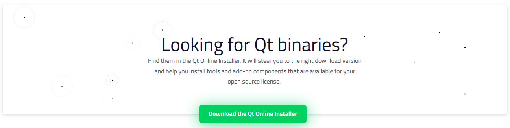
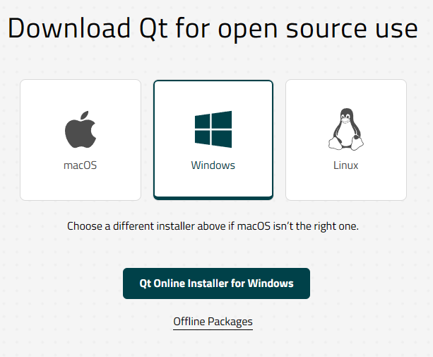
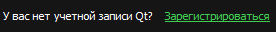
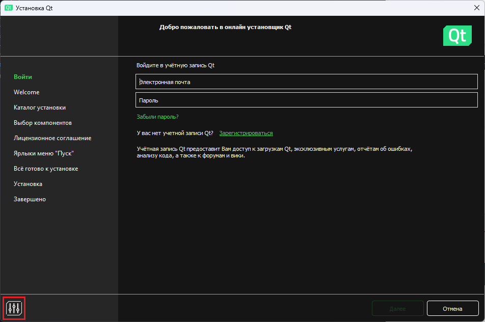
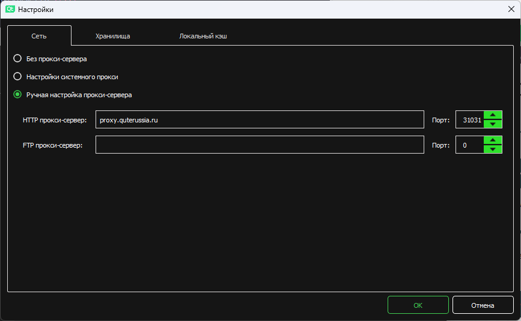
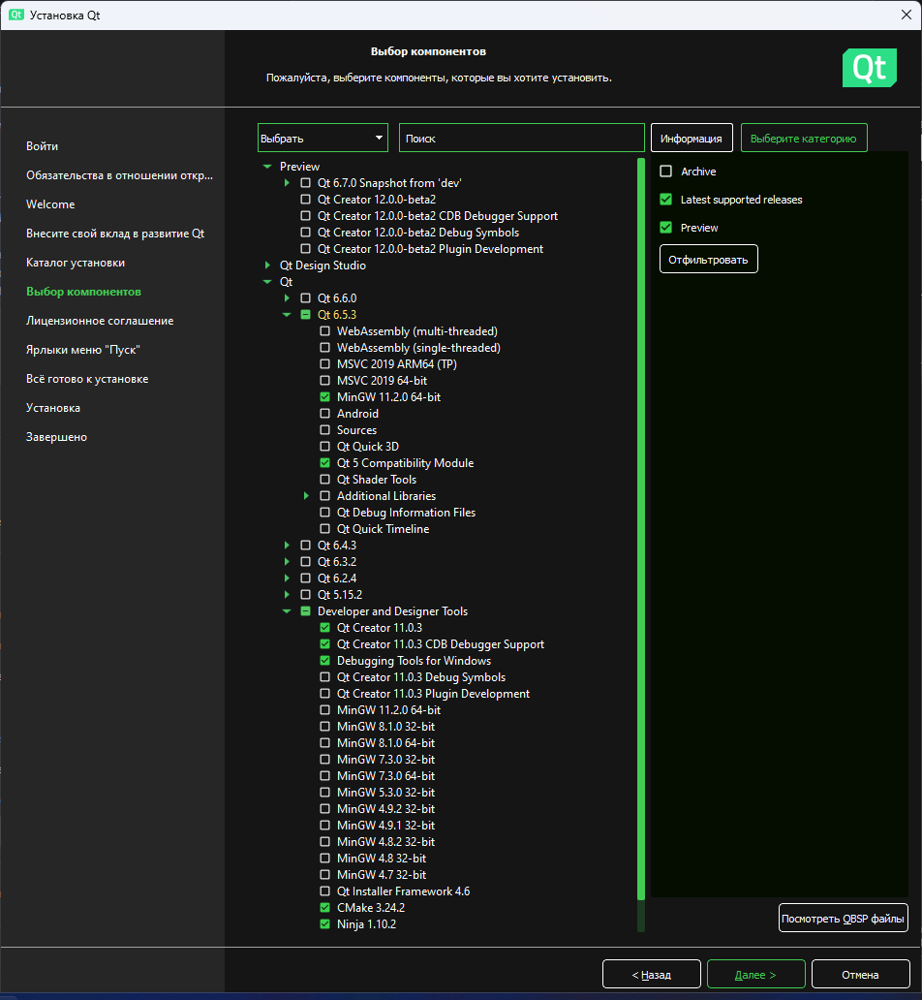
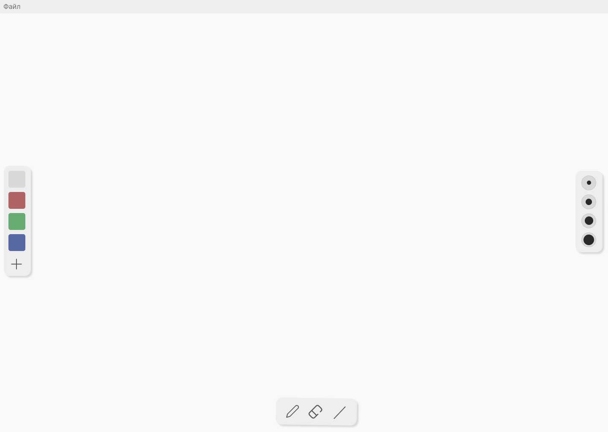

### Как скачать и установить Qt?

<ul>
    <li> Переходим по <a href="https://www.qt.io/download-open-source">ссылке</a> </li>
    <li> Листаем вниз, находим кнопку "Download the Qt Online Installer" и кликаем по ней </li>
    
    <li> Нажимаем на кнопку "Qt Online Installer for Windows" </li>
    
    <li> Дожидаемся окончания загрузки exe-файла и запускаем его </li>
    <li> Кликаем по "Зарегистрироваться" </li>
    
    <li> Вводим почту, пароль, принимаем условия, жмем "Далее" </li>
    <li> Заходим в свой почтовый ящик, открываем письмо от The Qt Company и кликаем по ссылке для подтверждения почты </li>
    <li> Заполняем свои данные (не забываем поставить галочку на "I am an individual person not using Qt for any company") и жмем "Confirm" </li>
    <li> Возвращаемся к установщику, заходим под новосозданной учетной записью и нажимаем на кнопку в левом нижнем углу (выделено красным) </li>
    
    <li> В открывшемся окне выбираем "Ручная настройка прокси-сервера", в поле "HTTP прокси-сервер" вбиваем <b>proxy.quterussia.ru</b>, в поле "Порт" вбиваем <b>31031</b> и жмем "ОК". </li>
    
    <li> Авторизуемся под своей учетной записью </li>
    <li> Ставим все галочки, жмем "Далее" </li>
    <li> Жмем "Далее" </li>
    <li> Выбираем любое и жмем "Далее" </li>
    <li> Выбираем "Выборочная установка", жмем "Далее" </li>
    <li> Ставим галочки, как на изображении ниже и жмем "Далее" (компилятор на самом деле можно выбрать любой, но если не знаете, какой вам подходит – выбирайте MinGW) </li>
    
    <li> Принимаем условия соглашения (<b>обязательно прочитать все!</b>) и жмем "Далее" </li>
    <li> Жмем "Далее" </li>
    <li> Жмем "Установить" </li>
    <li> Дожидаемся установки и выходим (<b>теперь вы смешарик!</b>) </li>
</ul>

### Как открыть проект?

<ol>
    <li> Скачиваем проект с этого репозитория (папка RisoVat) </li>
    <li> Заходим в Qt Creator, открываем проект (в данном случае файлом проекта является CMakeLists.txt) </li>
    <li> Выбираем комплект с установленным компилятором </li>
</ol>

### Задание от Михаила Александровича

<ol>
    <li> Сделать правую панель для выбора ширины кисти (как на картинке ниже) </li>
    
    <b>Раскрывая блок ниже, вы признаете свою слабость!</b>
    <details>
    <summary>Подсказка</summary>
  
Чтобы сделать круг, надо просто закруглить прямоугольник: 

```qml
radius: 180
```

Интересующее вас свойство называется: 
  
```qml
window.brushSize
```

</details>
<li> Добавить анимацию правой панели (опционально) </li>
<details>
    <summary>Подсказка</summary>
  
Анимацию делайте на примере панели <i>colors</i>, но хорошо подумайте, какое свойство будет меняться:

```qml
NumberAnimation
{
    property: ...
}
```

Обратите внимание, что для этой анимации вам также понадобится элемент <i>Timer</i>.

</details>

</ol>

